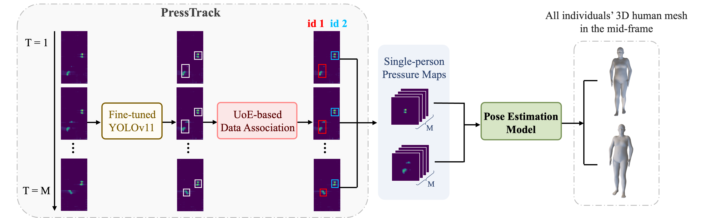

# PressTrack-HMR: Pressure-Based Top-Down Multi-Person Global Human Mesh Recovery



AAAI 2026 [[Paper]](https://arxiv.org/abs/2511.09147)

## PressTrack-HMR

The base codes are largely borrowed from [PIMesh](https://github.com/USTCWzy/PIMesh).

### Installation

* PressTrack-HMR is tested on Ubuntu 20.04.4 LTS with Pytorch 1.11.0 and Python 3.8.12. 
* Download SMPL-related parameters from [SMPL](http://210.45.71.78:8888/d/1fd39b4b0e3c4917a068/), and modify the SMPL path in the `core/trainer.py`, `model/smpl.py` and `model/spin.py` files. 

### Key Files

- `train.py`: Training entry point. It parses parameters, constructs datasets and models, and launches the Trainer.
- `test.py`: Testing entry point. It parses parameters, constructs datasets and models, and launches the Trainer.

- `model/multi_person.py`: Extracts single-person temporal pressure maps based on the ground-truth bounding box information in the dataset, invokes the SinglePersonHMR module, and outputs multi-person SMPL parameters.

- `model/track_processor.py`: Invokes the pre-trained YOLO footprint detection model, extracts single-person temporal pressure maps according to the tracked bounding boxes, calls the SinglePersonHMR model, and outputs multi-person SMPL parameters.

- `model/single_person.py`: Main body of the SinglePersonHMR module. It calls the image encoder, temporal encoder, and SMPL regressor, and outputs single-person SMPL parameters.

- `dataset/CarpetPressureDataset.py`: Reads, segments, and preprocesses (normalization) the MIP dataset.

- `core/trainer.py`: Implements training/validation/testing loops, records the optimal model, and calculates metrics such as MPJPE, PA-MPJPE, PVE, Accel, WA-MPJPE₁₀₀, and W-MPJPE₁₀₀.

- `core/MPloss.py`: Applies the Hungarian algorithm to find the optimal matching pairs between ground-truth SMPL and predicted SMPL, and invokes the single-person loss function SPHMRLoss.

- `core/SPloss.py`: Computes the single-person loss function, including losses for 3D keypoints, SMPL pose/shape/translation.

- `config/cmd_train_parser.py`: Defines command-line parameters.

### Training

* We provide an input example below based on the optimal configuration, but you are also free to adjust the parameters according to your specific requirements.	

  ```bash
  python train.py --gpu 1 --exp_mode unseen_sequence --lr 1e-5 --encoder resnet18 --temp_encoder trans --seqlen 16 --batch_size 16
  ```

  * After training, the checkpoints are saved in `${ROOT}/checkpoints/`, and the logs are saved in `${ROOT}/log/`. The experiment is named by your experiment setting as shown in `utils/others/utils.py def NoteGenration`

### Evaluation

* Download pre-trained weights from [checkpoints](http://210.45.71.78:8888/d/1fd39b4b0e3c4917a068/).
  
    ```shell
    Unseen_Sequence:  PressTrackHMR_unseen_sequence_resnet18_trans_spin_1e-05_16_16_0.9_768_1024
    ```  

## Multi-person Interaction Pressure (MIP) Dataset


Our dataset comprises data from 20 volunteers, including 20 sets of single-person data, 30 sets of multi-person data with randomly combined 2 or 3 individuals, and 2 sets of couple dance sequence, totaling over 138K synchronized tactile frames and SMPL annotation files. 

Download dataset from [MIP Dataset](https://drive.google.com/drive/folders/1KX649ucz8oKW9cE-8V_0UBxW5M_xhvCb?usp=sharing), and modify the `--dataset_path` in the `cmd_train_parser.py` file.

### Features

* **Three Modalities**:  Pressure, RGB, and SMPL annotation.

* **Pressure Mat**: 1.20×2.40㎡, with 120×240 sensing units and a pitch of 1cm×1cm.

* **Volunteers body attributes**:

    |  Age  | Gender |        | Height (cm) |      |               | Weight (kg) |       |              |
    | :---: | :----: | :----: | :---------: | :--: | :-----------: | :---------: | :---: | :----------: |
    | Range |  Male  | Female |     Max     | Min  |  Mean (std)   |     Max     |  Min  |  Mean (std)  |
    | 20-27 |   12   |   8    |     183     | 152  |  173.0 (8.8)  |     87.0    |  39.0 |  60.5 (12.1) |

### Contents

`data_*.npz`：including group name, pressure, footprint bounding boxes, 3D shape, segments

* Data Grouping Notes
  - `data_1.npz` to `data_20.npz`: Single-person group data
  - `data_21.npz` to `data_48.npz`: Two-person group data
  - `data_49.npz` and `data_50.npz`: Three-person group data
  - `data_51.npz` and `data_52.npz`: Two-person ballroom dancing data

* Reading codes

    ```python
    import numpy as np
    
    path = r'data_1.npz'
    data = dict(np.load(path, allow_pickle=True))
    
    # data is a dictionary instance
    
    print(data.keys())
    # dict_keys(['name', 'pressure', 'box', 'pose', 'betas', 'trans', 'keypoints_3d', 'segments'])
    ```

* keys

  * `name`: Group name (e.g., '1_person/A', '2_person/A_B'), where the prefix indicates the number of people in the scene.
  * `pressure`: Pressure image sequence with shape `(*, 238, 120)`. Here, `*` denotes the number of frames; the spatial dimensions are 238 (height) × 120 (width).
  * `box`: Bounding boxes of footprints with shape `(*, 3, 4)`. The dimension 3 represents the maximum number of people supported in a single frame. For positions corresponding to absent individuals, zero-padding is applied. Each bounding box is represented in the format (x1, y1, x2, y2), where (x1, y1) and (x2, y2) denote the top-left and bottom-right corner coordinates, respectively.
  * `pose`: SMPL pose parameter labels $\theta \in \mathbb{R}^{N \times 72}$ .
  * `betas`: SMPL shape parameter labels $\beta \in \mathbb{R}^{N \times 10}.$
  * `trans`: root translation labels in the world coordinate system in SMPL $t \in \mathbb{R}^{N \times 3}$.
  * `keypoints_3d`: 3D keypoint labels in the world coordinate system, consistent with SMPL's keypoint definition set.
  * `segments`: Valid sequence segments.


## Contact

If you have any questions about the paper, code and dataset, please feel free to contact [yuanjiayue@mail.ustc.edu.cn](mailto:yuanjiayue@mail.ustc.edu.cn).


